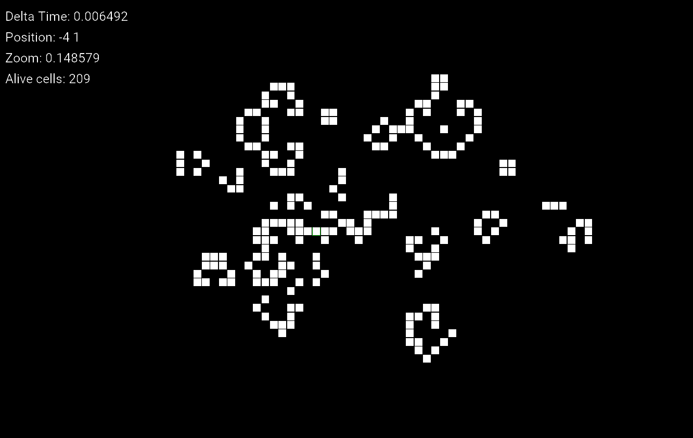

# Game of Life
This is an implementation of the [Game Of Life](https://en.wikipedia.org/wiki/Conway%27s_Game_of_Life) using the [XEngine](https://github.com/xenotux/xengine).

# Building
- Copy the XEngine and ImGui headers into lib/include
- Build and copy the XEngine library binary into lib/bin
- Build the gameoflife CMake target

# Screenshots
